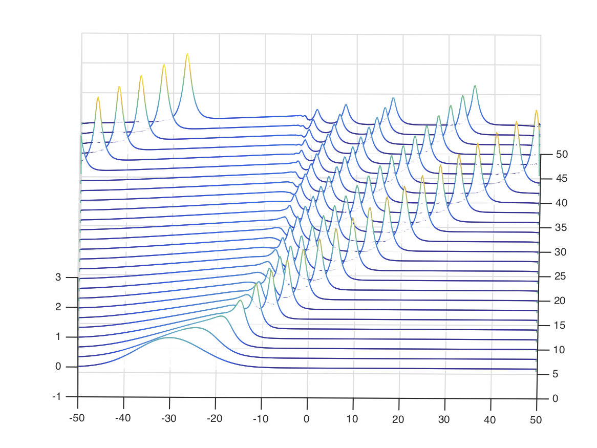

# Table of contents
1. [Introduction](#Intro)
2. [Background](#PreLim)
	1. [Optimal Control](#OptCont)
	2. [Fokker-Planck Equation](#FPEqn)
	3. [Fluid Dynamics View of Optimal Transport](#OptTransport)
	4. [Radial Basis Function Networks](#RBFN)
3. [Optimal Control Formulation for RBFN](#OptRBFN)
4. [Mean Field Optimal Control](#MFG)
	1. [Derivation of Mean Field Optimal Control](#MFOC)

# Introduction
In this exploratory note, the link between deep learning and fluid dynamics is explored. This enables us to find the limit of deep learning system when both the number of neurons and the number of layers approaches infinity. Recently, there has been an interest in formulating deep learning problems in terms of dynamical systems . In fact, dynamical systems were used in many neural network architectures, such as recurrent neural network, echo state machines, and spiking neurons to name a few. For the case of spiking neurons, the continuum limit yields a hyperbolic partial differential equation and the field of study is known as neural field theory. In the mentioned architectures, dynamical systems are used to compute the neural network's activation, while the recent focus is on using dynamical systems as a substitute for the whole architecture . Furthermore, the connection between training neural networks and optimal control has been an ongoing research.It is natural to think of optimal control as a method for training neural networks. Both problems aim to find parameters that would make a system give certain output when presented with specific inputs. There has been an interest in using a more general optimal control, mainly stochastic optimal control via mean field games. What is very interesting about this approach is it provides a pathway in formulating the stochastic control problems in fluid dynamics. The case for deterministic optimal control was shown that the control vector field does, indeed, satisfy the incompressible Euler fluid equation .

Here, training deep learning architectures is presented as an incompressible Euler fluid equation, albeit with an extra potential term. This achieved by first translating the deep learning networks to dynamical systems, then training is cast as a mean field optimal control problem. In addition to that, weights of a radial basis neural networks, constructed in an elaborate way, are shown to satisfy an integrable system of equations known as the Camassa-Holm equation .

# Background

## Optimal Control

The key to casting deep learning problems as optimal control problems is considering the residual neural networks as Euler discretisation of a dynamical system . A network with $N$ layers is then written as

$$ \label{eq:discreteResNet}
x_{t+1} = x_t + f(x_t, \theta_t),
$$

where $t = 0, \dots, N-1$. The initial condition $x(0) = x_0 \in \mathbb{R}^d$ is in neural networks language the input layer and $x(N) = x_T \in \mathbb{R}^d$ is the output layer. The variable $\theta_t$ is the trainable parameter and $f$ is the activation function. Taking the limit as $N \to \infty$ one would recover the continuous-time dynamical system for ResNet

$$
    \dot{x}(t) = f \left(x(t), \theta(t) \right)
$$

The solution of the discrete-time system $x_{t+1}$ at time $t = T$, or the output layer. For outputs $x_{i,T}$, the goal is to be as close as possible to the target $y_i$ with respect to a specified metric. To control how the vector field $f$, would achieve such a desideratum, the parameter $\theta_t$ is tuned so that the said metric be at a minimum. This in essence an optimal control problem. First, let us clarify what is meant by optimal control, however, the reader is encouraged to check the following resources for a detailed exposition on the subject , , and . 

A control system is a tuple $\Sigma = (\mathcal{X}, f, \mathcal{U})$, where
<ul>
<li> $\mathcal{X}$ is an open set in $\mathbb{R}^d$, </li>
<li> $\mathcal{U}$ is the set of admissible parameters, </li>
<li> and $f:\mathcal{X} \times \mathcal{U} \to \mathbb{R}^d$ is a continuous vector field. </li>
</ul>

The continuous system associated to $\Sigma = (\mathcal{X}, f, \mathcal{U})$ ResNet neural network is 

$$
    \dot{x}(t) = f \left(x(t), \theta(t) \right)
$$

This formulation is still general, but here are some of the important specific cases

A control ResNet $\Sigma = ( \mathcal{X}, f, \mathcal{U})$ is when $f$ has the form

$$
    f(x(t), \theta(t)) = \phi\left(\theta(t) \cdot x(t) + \theta_0(t) \right),
$$

where $\phi: \mathcal{X} \to \mathbb{R}$ is the standard activation function, such as hyperbolic tangent function, or sigmoid function. The term $\theta_0(t)$ acts as the neuron's bias. 

Another way of looking at continuous deep neural networks, which we will further study later, is when the whole vector field $f$ is considered the control parameter. 

A control neural network $\Sigma = ( \mathcal{X}, f, \mathcal{U})$ is when $f$ has the form 

$$
    f(x(t), \theta(t)) = \theta\left(x(t) ,t \right),
$$

where $\theta_t: \mathcal{X}\times \mathbb{R} \to \mathbb{R}^d$ is the control function. 

Before delving into the rest of the article, few notation are introduced. 

Given a control tuple $\Sigma = ( \mathcal{X}, f, \mathcal{U})$
<ul>
<li> A measurable map $\mu : I \to U $, where $I \subset \mathbb{R}$ is an interval, is said an admissible control if $f(x(t), \mu(t))$ is locally integrable. </li>
<li> The pair $(\xi, \mu)$ on interval $I$, where $\mu$ is admissible control, $\xi: I \to \mathcal{X}$ is called a controlled trajectory. </li>
</ul>

We define what was meant by metric earlier which is the called <b>the objective function</b> in control theory language. 

Given the control tuple $\Sigma = ( \mathcal{X}, f, \mathcal{U})$, a continuous and convex (or concave) map $\ell: \mathcal{X} \times \mathcal{U} \to \mathbb{R}$ is called <b>the cost Lagrangian</b>. If $\ell$ is the Lagrangian, the functional that maps the controlled trajectories $(\xi, \mu)$ to $\mathbb{R}$,

$$
    J_{(\xi, \mu)}= \int_I \ell(\xi(\tau), \mu(\tau)) \, d\tau,
$$

is called <b>objective function</b>.

The controlled trajectory solves the differential equation that describes the neural network. The aim is to minimise the objective function while steering the control trajectory from subset $x_0 \in \mathcal{X}$ to $x_T \in \mathcal{X}$. We then define neural network training problem as follows 

 <i> Optimal control problem: </i>
Given the control tuple $\Sigma = ( \mathcal{X}, f, \mathcal{U})$, and the cost Lagrangian $\ell$, then let $(x_0, y_0) \in \mathcal{X} \times \mathcal{X}$ be the training data and let $t_0, t_1 \in \mathbb{R}$. The controlled trajectory $(\xi^{\ast}, \mu^{\ast})$ is a solution of training problem of $\Sigma, (x_0, y_0)$ if $J_{(\xi^{\ast}, \mu^{\ast})} < J_{(\xi, \mu)}$ for each $(\xi, \mu)$.

One method that generalises the calculus of variations  is the **Pontryagin's Maximum Principle**, which provides the necessary condition of optimality. In general, there are two routes that one can take to solve the optimal control problem: by using Pontryagin's Maximum Principle, or dynamic programming principle. Each approach has its own pros and cons, however for stochastic optimal control dynamic programming is the de facto method and that has to do with the fact that it is a simple extension of the deterministic case. When applying dynamic programming principle, the continuous limit of the result is the celebrated stochastic Hamilton-Jacobi-Bellman equation. In the deterministic case, the Hamilton-Jacobi-Bellman equation is considered a generalisation of the Hamilton-Jacobi equation, and for the stochastic case is basically the deformation of Hamilton-Jacobi equation. The being said, the Pontryagin Maximum Principle approach is very difficult to apply to stochastic systems. Here, we still consider it for stochastic optimal control problems, but instead of the stochastic system as the constraint, the probability density is substituted for the system. 

Due to the fact that it is indispensable, we only recite Pontryagin's Maximum Principle. The proof of Pontryagin's Maximum Principle statement in geometric setting can be found in ,  and the supplement chapter of . One of the nucleus of Pontryagin's Maximum Principle is it constructs a Hamiltonian system to solve the optimal control problem. To state Pontryagin's Maximum Principle we first need to define the Hamiltonian and its family.

 <i>Control Hamiltonian, maximum Hamiltonian:</i>
Given the stochastic control system $\Sigma = (Q, f, \mathcal{U}, \Xi)$ and the cost Lagrangian $\ell$, then the Hamiltonian function associated to the control system $\Sigma$ is defined as

$$
\begin{aligned}
&H_{\Sigma} \quad : \quad Q \times \mathcal{U} \times T^{\ast}Q \mapsto \mathbb{R} \\
&H_{\Sigma}(q, p, u) = \left\langle p, f(q, u) \right\rangle + \ell(q, u).
\end{aligned}
$$

Along with that we define the maximum Hamiltonian as

$$
\begin{aligned}
&H_{\Sigma}^{max} \quad : \quad Q \times T^{\ast}Q \mapsto \mathbb{R} \\
&H_{\Sigma}^{max}(q, p) = \sup \left\{ H_{\Sigma}(q, p, u) \quad | \quad u \in \mathcal{U} \right\}
\end{aligned}
$$

 <i>Pontryagin's Maximum Principle:</i>
Let $\Sigma = (Q, f, \mathcal{U},)$ be the control system, and let $q_0$ and $q_T$ be the disjoint sub-manifolds of $Q$. If the pair $(q, u)$ solves the optimal control problem, i.e. minimises the cost functional

$$
\mathbb{S} = \int \ell(q(x,t), u(x,t)) dt
$$

subject to $\dot{q}(x,t) = f(q(x,t), u(x,t))$, with $q(x,0) = q_0$ and $q(x,T) = q_T$, then there exists $\lambda_0 = \{0, 1 \}$ and a cotangent vector 

$$
\lambda:[0,T] \mapsto T^{\ast}Q
$$

along $q$ and the Hamiltonian $H_{\Sigma}^{max}( \lambda(t)) = \sup_{u \in \mathcal{U}} H_{\Sigma}( \lambda(t))$ and $\lambda(t)$ evolves in time according to

$$
\dot{\lambda} = X_{H_{\Sigma}^{max}}(\lambda(t))
$$

In other words, $\lambda$ is an integral curve of Hamiltonian vector field associated with $H_{\Sigma}^{max}$. Along with that, it also satisfies the following transversality conditions:  $\lambda(0) \in ann(T_{q(t_0)}q_0)$ and $\lambda(1) \in ann(T_{q(t_1)}q_T)$ and we either have $\lambda_0 = 1$ or $\lambda(0) \neq 0$ and finally there exists a positive constant $C \in \mathbb{R}$ such that the maximum Hamiltonian is constant, i.e. $H_{\Sigma}^{max}(\lambda(t)) = C$.

The proof of this theorem is very technical and it requires time, so it will be left out of this course, however, the reader might wish to check  for detailed exposition on Pontryagin's Maximum Principle. A special attention is needed for the last statement, $h(\lambda)$, which implies that the integral curve of the covector $\lambda^{\ast}$ is a constant of motion for the dynamics governed by the Hamiltonian vector field associated to $H_{\Sigma}^{max}$. Basically, the solution of the Hamiltonian system

$$
\dot{x} = \frac{\partial H_{\Sigma}}{\partial \lambda}, \quad \dot{\lambda} = - \frac{\partial H_{\Sigma}}{\partial x}, \quad \frac{\partial H_{\Sigma}}{\partial u} = 0.
$$

## Fokker-Planck Equation

Consider the stochastic control system given by

$$
X(t) = X_0 + \int_0^t u(X(\tau)) \, d\tau + \sum_k \int_0^t \sigma_k(X(\tau))dW_{\tau}^k,
$$
and
$$
X(0) = x_0, \quad X(T) = x_T
$$
where $u: \mathcal{X} \to \mathbb{R}^N$, and $\sigma_k : \mathcal{X} \to \mathbb{R}^N$ are diffusion vectors and both $u$ and $\sigma_k$ are assumed to satisfy the regularity and linear growth conditions that guarantee the existence and uniqueness of the solution of $X(t)$. $W_t$ are independent and identically distributed Brownian motions that are adapted to a filtration $\mathcal{F_{t, t\geq 0}}$. The stochastic process $X(t)$ is a Markov process and its transition probability $P(X(t_0), t_0| X(t_1), t_1)$, i.e the probability of transitioning from the state $X(t_0)$ at time $t_0$ to the state $X(t_1)$ at time $t_1$ and it satisfies:
<ul>
<li>the probability $P(X(t_0), t_0| X(t_1), t_1)$ is Borel measurable in an open subset $D$ of $\mathbb{R}^N$, while $t_0$, $t_1$, and $X(t_1)$ are held fixed, </li>
<li> $P(X(t_0), t_0| X(t_1), t_1)$ is a probability measure, while $t_0$, $t_1$ and $X(t_1)$ are held fixed. </li>
<li> $P(X(t_0), t_0| X(t_1), t_1)$ satisfies Chapman-Kolmogorov equation. </li>
</ul>
Consider the function $f \in C^2(\mathbb{R}^N)$, then its rate of change along a stochastic path is obtained using Ito's lemma, and taking the expected value with $P(X(t_0), t_0| X(t_1), t_1)$ as its probability measure. Integration by parts then yields **the Fokker-Planck equation**, or what is also known as Kolmogorov forward equation given by

$$
\partial_t \rho(x,t) = -\mathrm{div}( \rho u) + \frac{1}{2} \sigma^2 \Delta \rho, \quad \rho(x,0) = \delta(x)
$$

where $\rho$ is the probability density function. Going back to the optimal control problem, instead of using the Pontryagin's Maximum Principle with the differential equation for $X(t)$, the Fokker-Planck equation is used instead. The cost function here is chosen to be the expected value of the cost Lagrangian.

## Fluid Dynamics View of Optimal Transport
A similar construction, albeit for deterministic systems, was introduced by Benamou and Brenier in , where they proved that the Monge-Kantorovich problem of finding a map $f$ that would transport the density $\rho_0$ to $\rho_T$ while in the same time minimising the 2-Wasserstein metric

$$
d_2(\rho_0, \rho_T)^2 = \inf_{f} \int | f(x) - x |^2 \rho_0(x) dx,
$$

both densities satisfy $\int \rho_0(x) dx = 1$ and $\int \rho_T(x) dx = 1$. The solution $f(x)$, which preserves the boundedness of the densities is a pullback of the density, i.e. $f^{\ast}( \rho_T(x)) = \rho_0(x)$. Furthermore, the map $f$ can be written as a gradient of a convex function $\Psi$ and that makes the pullback relation the following

$$
\mathrm{det}\left( \mathrm{Hess}(\Psi)\right)(\rho_T(\nabla \Psi(x))) = \rho_0(x),
$$

which is the Monge-Ampère equation. The said equation is very difficult to solve even numerically and for this reason  formulated as a fluid mechanics problem. The Monge-Kantorovich problem is equivalent to minimising the following functional

$$
\int_{\Omega}\int_0^T \rho(x) | v(t,x) | \, dt dx
$$

which is constrained by the transport equation

$$
\partial_t \rho = -\nabla \cdot ( \rho v), \quad \rho(0) = \rho_0, \quad \rho(T) = \rho_T
$$

The adjoint equation, that describes the evolution of the Lagrange multiplier is the Hamilton-Jacobi-Bellman equation 
$$
\partial_t \lambda  +\frac{1}{2} | \nabla \lambda|^2 = 0,
$$

where the optimality condition is $ v(t,x) = \nabla \lambda$. Taking the gradient of the Hamilton-Jacobi-Bellman equation, we obtain the pressure-less Euler equation
$$
\partial_t v + v \cdot \nabla v = 0
$$

## Radial Basis Function Networks
In , the residual neural network, ResNet, is considered as part of the control tuple $\Sigma = (\mathcal{X}, f, \mathcal{U})$ and this motivated out investigation. Instead of ResNet, we consider a different type of neural networks known as **radial basis function network**, RBFN for short . Radial basis function network is a network with forward architecture with only three layers; input, hidden and output. For the activation function, as its name suggests, it uses radial basis function. That being said, the research topic of deep radial basis function network has not been very active, and here care is taken in this subject. As with the family of radial basis function,  the distance between two points the function's argument, and here the distance is between the input, $x_i$, and the centre of the neurons, $c_i$. The smaller the distance between the input and the centre at the larger the output of the function and vice-versa. The activation functions of the hidden neurons are then combined together to yield the final output

$$
    y = \sum_{i=1}^N \omega_i \phi_i( d(x_i, c_i)),
$$

where $\omega_i$ are weights of the hidden neurons and they determine the influence of the a neuron on the output. 

Training of such type of neural network is done in two stages, the first uses a clustering algorithm, such as $k$-mean clustering. The first step is needed to determine the centres $c_i$. The second step determines the weights $\omega_i$. 

Here  we use the radial basis function network in a slightly different way. The first dissimilarity is that the number of outputs is the same of the inputs. The second dissimilarity is that not implemented in a pure forward architecture, but with the outputs are fed back as inputs. In mathematical terms that is 

$$
    x^{t+1}_j = \sum_{i=1}^N \omega_i e^{-\| x^t_j - x^t_i \|^2}
$$

and the the continuous-time dynamical system is

$$
    x_j(t) = \sum_{i=1}^N \omega_i(t) e^{-\| x_j(t) - x_i(t) \|^2}.
$$

# Optimal Control Formulation for RBFN
Here we formulate the training of radial basis function network as an optimal control problem. Consider the training data $(\mathbf{x_{j}}(0), \mathbf{y_j})$, where $\mathbf{x_{j}}(0) \in \mathbb{R}^d$ is the $i^{th}$ entry of the training data set. Consider the control system $\Sigma = ( \mathcal{X}, f, \mathcal{U})$ with $f(x, t) = \sum_i \omega_i(t)e^{- \| x(t) - x_j(t) \|^2}$. The goal is to find $\omega_i$ that would steer the control system $\Sigma$ from  $\mathbf{x_{j}}(0)$ at time $t = 0$, to the state $\mathbf{x_{j}}(T)$ at time $t = T$ that is close to $\mathbf{y_j}$. The objective function is defined by

$$
    J_{(\xi, \mu)} = \int_0^T \ell(f(\xi(\tau), \mu(\tau))) \, d\tau + \Phi \left( \mathbf{x_{j}}(T) - \mathbf{y_j} \right),
$$

where $\Phi$ is the terminal condition. The cost Lagrangian here is not chosen as the $L^2$ norm, but instead a norm with the metric chosen as $g_{ij} = e^{-\| x_i - x_j \|^2}$. In explicit terms that is

$$
    \ell(\omega(t)) = \frac{1}{2}\sum_{i,j = 1}^N \omega_i(t) \omega_j(t) e^{-\| x_i(t) - x_j(t) \|^2}.
$$

The Pontryagin's Hamiltonian is then

$$
    H_{\Sigma}(x(t), \omega(t)) = \frac{1}{2}\sum_{i,j = 1}^N \omega_i(t) \omega_j(t) e^{-\| x_i(t) - x_j(t) \|^2},
$$

and the Hamilton's equations are then 

$$
\begin{aligned}
    \dot{x}_j(t) =& \sum_{i=1}^N \omega_i(t) e^{-\| x_i(t) - x_j(t) \|^2} \\
    \dot{p}_j(t) =& -\| x_i(t) - x_j(t) \|\sum_{i=1}^N \omega_j(t)\omega_i(t) e^{-\| x_i(t) - x_j(t) \|^2}
\end{aligned}
$$

This system is interesting in itself, when replacing the radial basis function with $e^{- \lvert x_i(t) - x_j(t)\rvert}$, which is the Green's function for the differential operator $D = \mathrm{Id} - \partial_{xx}$ and it is the weak solution of the dispersionless Camassa-Holm equation

$$
    \partial_t u - \partial_{txx}u  = -3 u \partial_x u + 2 (\partial_x u) \partial_{xx} u + u \partial_{xxx}u,
$$

which is in turn it is the Euler-Poincaré on the group of diffeomorphism with Sobolov norm $H^1$ , and . The Camassa-Holm equation is an infinite dimensional system and  it models waves in shallow water, and it is an integrable system. Furthermore, the Hamilton's equation for $(x,p)$ form an integrable system. This type of systems, the ones whose Pontryagin's Hamiltonian yields an integrable system is studied in details in .

Given the radial basis function network in continuous-time form of RBFN in <a href='RBFN'>the previous section </a>, and the training set $\mathcal{D} = \{ \mathbf{x}_i(0), \mathbf{y}_i \}$, where $i = 0, \dots, N_{samples}$, $\mathbf{x}_i(0)\in \mathbb{R}^d$ is input of the $i^{th}$ sample and $\mathbf{y}_i $ is its label. The weights that minimise the objective function for training of RBFN system are solution to the Camassa-Holm equation.

|  | 
|:--:| 
| *The solution of the Camassa-Holm equation with the initial condition chosen to be a Gaussian function and periodic boundary conditions. One of the features of this equation is its wave-breaking mechanism and as a result peaked solitary waves, known as peakons, emerge.* |

# Mean Field Optimal Control

In recent years there has been an interest in **mean field games theory** view of optimal control and that is due to the fact that it uses deterministic quantities to derive optimal control laws for stochastic systems. One of the first attempts at this type of control was in  where a control for an ensemble of stochastic system was sought. That is not the only reason; the problem is very rich mathematically, and it provides many interesting connections with other established fields. Why there's interest in such a framework, the primary reason is applying Pontryagin's Maximum Principle to stochastic optimal control problem. That way allows for to use of differential geometry in dealing with nonlinear stochastic control systems. Although dynamic programming approach has been successful for the stochastic problem, except it presents us with few technical difficulties as the only way to obtain the optimal control law is by solely solving the stochastic Hamilton-Jacobi-Bellman equation, which is a nonlinear backward partial differential equation, Solving the Hamilton-Jacobi-Bellman equation is challenging in itself. Furthermore, the Pontryagin's Maximum Principle is tempting as it allows us for a direct way in attempting to formulate the problem in the language of multisymplectic geometry. Pontryagin's Maximum Principle for deterministic finite-dimensional systems is equivalent to solving a Hamiltonian system, thus it allows to use the tools of symplectic geometry to solve the system in question and even construct robust numerical algorithms using symplectic integrators.
Furthermore, for some cases optimal control problems are related to the fluid mechanics problems and here we study the dynamical systems that arise from such problems , and . 

Mean field games theory was developed by Lasry and Lions ,  and Caines et al   to model games with an infinite number of players or agents. Each player wants to maximise/minimise a certain quantity with respect to a certain criterion, for example, spend the least amount of money. The behaviour of the player takes into consideration the behaviour of other players. Examples of such "situations" are abundant in nature and society.  The decision taken by each agent does not affect the overall behaviour or the state of the population, the decision making for all members of the population is done in a decentralised manner. One main assumption of the mean field games is that all agents are indistinguishable, and they are modelled by a state $X^i_t$, where $1 \leq i \leq N$. A summary of the mathematics behind mean field games theory is given here, however, the keen reader is advised to , , and . Francophone reader might consider also reading the first papers on this topic , . Consider a population of $N$ agents where each agent has control over the stochastic differential equation

$$
X_i(t) = \int_0^t u_i(X_i(t), \tau) d\tau + \int_0^t \sigma_i(X_i(t)) dW_i(\tau), \quad X_i(0) = x_i \in \mathbb{R}^d
$$

complying with the notation used in these notes, the drift is denoted by $u$ is the control, or strategy, and the variance is denoted by $\sigma$ and $dW$ are independent Brownian motion adapted to a filtration $\mathcal{F_{t, t\geq 0}}$. As mentioned in the background section, such process is a Markov process and its probability density function satisfies the Fokker-Planck equation. Mean field games system is then described as

$$
    \begin{cases}
    \partial_t \lambda + H(\rho, \lambda, u) + \sigma^2 \Delta \lambda = 0 \\
    \partial_t \rho + \mathrm{div}(\rho D_{p}H(\rho, \lambda, u)) - \sigma^2 \Delta \rho = 0 \\
    \rho(x,0) = \rho_0, \quad \rho(x,T) = \rho_T,
    \end{cases}
$$

where $H$ is a Hamiltonian function that is convex.  As a member tries to take the best decision for them, the decision making can be viewed from a game theory problem. However, game theory becomes very difficult to solve as the number of players exceeds three. However, as the size of the population goes to infinity, the solution consists of points of Nash equilibrium. 

 <i>Informal Nash equilibrium: </i> Given a choice of strategy, or control $u_i$ of a player $i$, when there is no incentive for player $i$ to change its strategy given the other players' (or competitors) choice of strategy. In other words, the player is in a position that its decision is not affected by the decision of other players. When that happen, it is said that players are in a <b>Nash equilibrium </b>. 

 <i>Formal Nash equilibrium:</i> Given a choice of strategy $\widetilde{u} = (u^1, \dots u^N)$ of a all the players is a Nash equilibrium is when the objective function, $J$, for the $i^{th}$ player/agent satisfies
$$
    J(\widetilde{u}^i) < J(\widetilde{u}^j), \quad \text{for all $j \neq i$}.
$$

Such equilibrium can be obtained by differential games method and game theory, but its difficult to arrive at such equilibrium. However, the assumptions made in mean field game theory allows one to obtain Nash equilibrium and that is by considering an infinite number of players/agents.

Now, a mean field games theory aficionado would probably ask: what can stochastic geometric control theory introduce to mean field games? Two things in general: first, the tools of differential geometry can be applied to mean field games theory. So now the considered agents can be modelled by nonlinear stochastic differential equations with symmetry and how this symmetry can be used to reduce the degrees of freedom. The second is to cast the system of HBJ-FP equations in a geometric structure and use this structure to help in inferring properties and even solve the optimal strategy. 

The approach considered here to mean field optimal control relies on the Fokker-Planck equation that describes the evolution of the probability density function of the Markov processes $X_i$ the describe the control stochastic system in question. This can be viewed as a generalisation of .

## Deriving Mean Field Optimal Control

In this section the mean field optimal control using Pontryagin's Maximum Principle is derived. The control dynamics are 

$$
    X_i(t) = X_i(0) + \int_0^t u(X_i(\tau), \tau) \, d\tau + \sum_k \int_0^t \sigma_k(X_i(\tau)) \circ dW_k(\tau),
$$

with

$$
X_i(0) = x_0, \quad X_i(T) = x_t
$$

where $X_i \in \mathbb{R}^d$, $u \in \mathcal{U}$ and $W_k$ are independent and identically distributed Brownian motions that are adapted to filteration $\mathcal{F_{t, t \geq 0}}$. The stochastic integral is taken in the Stratonovich sense. The Fokker-Planck equation is for this control system is 

$$
    \partial_t \rho + \mathcal{L_{u}} \rho - \frac{1}{2} \mathcal{L_{\sigma_k}} \mathcal{L_{\sigma_k}} \rho = 0, \quad \rho(x,0) = \delta (x_0), \quad \rho(x, T) = \rho_T
$$

The symbol $\mathcal{L}$ denotes a Lie derivative, and $\mathcal{L_{u}} \rho$ is the Lie derivative of a density along the vector field $u$ and it is given explicitly by

$$
    \mathcal{L_{u}} \rho = \mathrm{div}(\rho u)
$$

 
When the control system whose state described by the expression for $X(t)$, presented at the begining of this section, has a Stratonovich noise, the Fokker-Planck equation can then be written with a double Lie derivative. 

The control system is now a tuple $\Sigma = (\mathcal{X}, u, \mathcal{U})$ and the objective function is given by

$$
    J_{(\rho, u)} = \int_0^T \int \rho \ell(u) \, dx \, dt + \Phi(\rho(x,T) - \rho_T)
$$

and the Pontryagin's Hamiltonian is given by

$$
    H_{\Sigma} = \int \frac{1}{2} \rho u^2 \, dx + \left\langle \lambda, -\mathcal{L_{u}} \rho + \frac{1}{2} \mathcal{L_{\sigma_k}} \mathcal{L_{\sigma_k}} \rho \right\rangle,
$$

where $\lambda$ acts as the Lagrange multiplier. Hamilton's equations, or to be more precise De Donder-Weyl equations, associated with Pontryagin's Maximum Principle are given by

$$
    \begin{cases}
    \partial_t \rho = \frac{\delta H_{\Sigma}}{\delta \lambda} =  -\mathcal{L_u} \rho + \frac{1}{2} \mathcal{L_{\sigma_k}} \mathcal{L_{\sigma_k}} \rho \\
    \partial_t \lambda = \frac{\delta H_{\Sigma}}{\delta \rho} = -\mathcal{L_u} \lambda - \frac{1}{2} \mathcal{L_{\sigma_k}} \mathcal{L_{\sigma_k}} \lambda + \frac{1}{2}u^2\\
    0 = \frac{\delta H_{\Sigma}}{\delta u} = \rho u - \rho \nabla \lambda
    \end{cases}
$$

At this point it is obvious that when $\sigma_k \to 0$, the fluid mechanics formulation of Monge-Kantorovich problem mentioned earlier is recovered. However, the double Lie derivatives do not translate to double Lie derivative for the Euler fluid equation. This is not the end of the road here, the idea is to derive the De Donder-Weyl equations associated with Pontryagin's Maximum Principle using a transformed Fokker-Planck equation.  Consider the case when the dynamics for the control problem are simplified to 

$$
    X_i(t) = X_i(0) + \int_0^t u(X_i(\tau), \tau) \, d\tau +  \int_0^t \sigma \circ dW_k(\tau), \quad X_i(0) = x_0, \quad X_i(T) = x_t,
$$

where $\sigma \in \mathbb{R}$ is a constant. The Fokker-Planck equation then simplifies to 

$$
    \partial_t \rho + \mathcal{L_u} \rho - \sigma^2 \Delta \rho = 0.
$$

Let $u(x,t) = v(x,t) + \sigma^2\nabla \mathrm{log} \rho$, which can be viewed as akin to Helmholtz decomposition, Fokker-Planck equation becomes

$$
    \partial_t \rho + \mathcal{L_v} \rho  = 0,
$$

and the Pontryagin's Hamiltonian is 

$$
    H_{\Sigma} = \int \frac{1}{2} \rho \|v \|^2 \, dx+ \sigma^2\int \rho \|\nabla \mathrm{log} \rho \|^2 \, dx \left\langle p, 1 - \int \rho \, dx \right\rangle + \left\langle \lambda, -\mathcal{L_{v}} \rho  \right\rangle ,
$$

The term $\int \rho \|\nabla \mathrm{log} \rho \|^2 \, dx$ is Fisher information metric and the extra constraint $\left\langle p, 1 - \int \rho \, dx \right\rangle $ is to ensure that the vector field $v$ remains incompressible. With this, the De Donder-Weyl equations are

$$
    \begin{cases}
    \partial_t \rho = \frac{\delta H_{\Sigma}}{\delta \lambda} =  -\mathcal{L_v} \rho  \\
    \partial_t \lambda = \frac{\delta H_{\Sigma}}{\delta \rho} = -\mathcal{L_v} \lambda  + \frac{1}{2} \|v \|^2 + \sigma^2 \frac{\nabla \sqrt{\rho}}{\sqrt{\rho}} + p\\
    0 = \frac{\delta H_{\Sigma}}{\delta v} = \rho v - \rho \nabla \lambda \\
    \frac{\delta H_{\Sigma}}{\delta p} = 1 - \int \rho \, dx
    \end{cases}
$$

Taking the gradient of the second equation, which is the Hamilton-Jacobi equation, we obtain the Madelung equation, also known as quantum Euler equation

$$
\begin{cases}
    \partial_t \rho + \mathcal{L_v} \rho = 0  \\
    \partial_t v + \mathcal{L_v} v = \sigma^2 \nabla \left( \frac{\nabla \sqrt{\rho}}{\sqrt{\rho}} \right) - \nabla p\\
    \mathrm{div}(v) = 0
\end{cases} 
$$

References
----------

